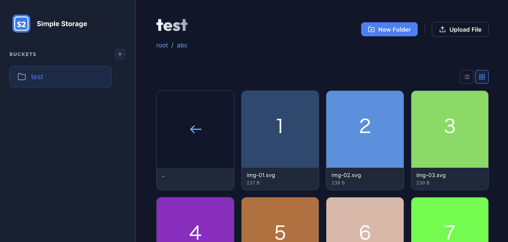

<p align="center">
  
</p>

# S2 — Simple Storage

[](https://pkg.go.dev/github.com/mojatter/s2)
[](https://goreportcard.com/report/github.com/mojatter/s2)

S2 is a lightweight object storage library and S3-compatible server written in Go.

## Why S2?

MinIO was the go-to S3-compatible server for local development, but it entered maintenance mode in December 2025 and was archived in February 2026. S2 fills this gap with a different philosophy:

- **Drop-in MinIO replacement** — Same role in `docker-compose` for local development.
- **Unified Storage interface** — Stop reinventing the S3-vs-local-filesystem swap in every project.

## Features

- **S3-Compatible Server** — Enough for local development, with `osfs` and `memfs` out of the box
- **Web Console** — Built-in browser interface for managing buckets and objects
- **Lightweight** — Minimal dependencies, single binary, `go install` ready
- **Unified Storage Interface** — One API for local filesystem, in-memory, AWS S3, Google Cloud Storage, and Azure Blob Storage
- **Pluggable Backends** — Register storage implementations with a blank import

<p align="center">
  
</p>

<p align="center">
  
</p>

## Migrating from MinIO

For most local-development use cases, replacing MinIO with S2 is a one-line change in `docker-compose.yml`. S2 serves the S3 API at the root path on `:9000` — the same endpoint layout MinIO uses — so existing S3 clients need no changes. The Web Console runs on a dedicated port (`:9001` by default) so that the S3 API owns the root path cleanly.

**docker-compose.yml**

```yaml
services:
  s2:
    image: mojatter/s2-server
    ports:
      - "9000:9000" # S3 API
      - "9001:9001" # Web Console
    environment:
      S2_SERVER_USER: myuser
      S2_SERVER_PASSWORD: mypassword
      S2_SERVER_BUCKETS: assets,uploads
    volumes:
      - s2-data:/var/lib/s2

volumes:
  s2-data:
```

**Environment variable mapping**

| MinIO | S2 |
|-------|----|
| `MINIO_ROOT_USER` | `S2_SERVER_USER` |
| `MINIO_ROOT_PASSWORD` | `S2_SERVER_PASSWORD` |
| `MINIO_VOLUMES` | `S2_SERVER_ROOT` (default `/var/lib/s2`) |
| `MINIO_DEFAULT_BUCKETS` | `S2_SERVER_BUCKETS` |
| `MINIO_BROWSER` / `MINIO_CONSOLE_ADDRESS` | `S2_SERVER_CONSOLE_LISTEN` (default `:9001`; empty disables) |

**Migrating existing data** — use any S3 client to copy data from MinIO to S2:

```sh
# Mirror an existing MinIO instance into a fresh S2 instance
aws --endpoint-url http://old-minio:9000 s3 sync s3://my-bucket /tmp/dump
aws --endpoint-url http://localhost:9000 s3 sync /tmp/dump s3://my-bucket
```

Or use `mc mirror` directly between the two endpoints.

## Anatomy

S2 has two parts: **S2 Server**, a standalone S3-compatible daemon, and a Go **library** you import into your code. S2 Server embeds the library, so both share the same pluggable backends.

```
                   ┌───────────────────────────────┐
                   │              S2               │
                   └───────────────────────────────┘
                      │                          │
         ┌────────────┴─────────┐   ┌────────────┴─────────┐
         │      S2 Server       ├──►│      S2 library      │
         │                      │   │                      │
         │  run as S3 endpoint  │   │  import from Go      │
         │  (drop-in for MinIO) │   │  (s2 package)        │
         └──────────────────────┘   └───────┬──────────────┘
                                            │
                                            │ implemented by
                                            ▼
                    ┌──────────────────────────────────────┐
                    │   Backends                           │
                    │   osfs · memfs · s3 · gcs · azblob   │
                    └──────────────────────────────────────┘
```

## S2 Server Storage Layout

The `osfs` backend stores objects as plain files on disk under the configured root directory (default `/var/lib/s2` in Docker, `./data` otherwise). Each bucket is a top-level directory, and object keys map directly to file paths:

```
$S2_SERVER_ROOT/
├── assets/                 # each top-level dir is a bucket
│   ├── .keep               # bucket marker (tracks creation time)
│   ├── logo.png
│   └── css/
│       ├── .meta/
│       │   └── style.css   # JSON metadata for ../style.css
│       ├── .keep
│       └── style.css
└── uploads/
    ├── .keep
    └── photo.jpg
```

You can **seed a bucket by bind-mounting a host directory** — handy for serving git-tracked static assets without uploading them manually.

```yaml
services:
  s2:
    image: mojatter/s2-server
    ports:
      - "9000:9000"
      - "9001:9001"
    environment:
      S2_SERVER_USER: myuser
      S2_SERVER_PASSWORD: mypassword
    volumes:
      - ./public/assets:/var/lib/s2/assets   # host dir → bucket "assets"
      - s2-data:/var/lib/s2

volumes:
  s2-data:
```

The bind-mounted directory is auto-recognized as a bucket — no `S2_SERVER_BUCKETS` entry needed.

> **Note:** Without a `.keep` file, the bucket's creation timestamp falls back to the current time (cosmetic only).

## Install

### Install server

```sh
go install github.com/mojatter/s2/cmd/s2-server@latest
```

Or run with Docker:

```sh
docker run -p 9000:9000 -p 9001:9001 mojatter/s2-server
```

### Install library

```sh
go get github.com/mojatter/s2
```

Cloud backends live in separate modules — install only what you need:

```sh
go get github.com/mojatter/s2/s3     # AWS S3
go get github.com/mojatter/s2/gcs    # Google Cloud Storage
go get github.com/mojatter/s2/azblob # Azure Blob Storage
```

> **Note:** If your code already imports a backend package (e.g. `_ "github.com/mojatter/s2/s3"`), `go mod tidy` will add the required module automatically.

## Quick Start

### As a local S3 server

Start the server:

```sh
# via go install
s2-server

# via Docker
docker run -p 9000:9000 -p 9001:9001 -v /your/data:/var/lib/s2 mojatter/s2-server
```

Then access it with any S3 client:

```go
package main

import (
	"context"
	"fmt"

	"github.com/mojatter/s2"
	_ "github.com/mojatter/s2/s3" // registers s3 backend
)

func main() {
	ctx := context.Background()
	strg, err := s2.NewStorage(ctx, s2.Config{
		Type: s2.TypeS3,
		Root: "my-bucket",
		S3: &s2.S3Config{
			EndpointURL: "http://localhost:9000",
		},
	})
	if err != nil {
		panic(err)
	}
	res, err := strg.List(ctx, s2.ListOptions{Limit: 1000})
	if err != nil {
		panic(err)
	}
	fmt.Printf("%v\n", res.Objects)
}
```

Or use the AWS CLI:

```sh
aws --endpoint-url http://localhost:9000 s3 ls
aws --endpoint-url http://localhost:9000 s3 cp ./file.txt s3://my-bucket/file.txt
```

### As a library

Define your storages in a JSON file (`s2.json`):

```json
{
  "assets": { "type": "osfs", "root": "/var/data/assets" },
  "backups": { "type": "s3", "root": "my-backup-bucket" }
}
```

Then load and use them with `s2env` (`go get github.com/mojatter/s2/s2env`):

```go
package main

import (
	"context"

	"github.com/mojatter/s2"
	"github.com/mojatter/s2/s2env"
)

func main() {
	ctx := context.Background()
	storages, err := s2env.Load(ctx, "s2.json")
	if err != nil {
		panic(err)
	}
	assets := storages["assets"]

	obj := s2.NewObjectBytes("hello.txt", []byte("Hello, S2!"))
	if err := assets.Put(ctx, obj); err != nil {
		panic(err)
	}
}
```

For per-backend configuration fields, multi-backend examples, and an explicit-import alternative (`s2.LoadConfigsFile`), see [docs/backends.md](docs/backends.md).

### In tests

For tests, swap any backend for `memfs` to get an isolated, in-process storage with no Docker, no temp directories, and no cleanup. The same `s2.Storage` interface is used in production and tests.

```go
package mypkg_test

import (
	"context"
	"testing"

	"github.com/mojatter/s2"
	_ "github.com/mojatter/s2/fs" // registers osfs + memfs
)

func TestUploadAvatar(t *testing.T) {
	ctx := context.Background()
	strg, err := s2.NewStorage(ctx, s2.Config{Type: s2.TypeMemFS})
	if err != nil {
		t.Fatal(err)
	}

	if err := UploadAvatar(ctx, strg, "user-1", []byte("...")); err != nil {
		t.Fatal(err)
	}
	// assert via strg.Get / strg.List ...
}
```

[`s2test.StorageDelegator`](https://pkg.go.dev/github.com/mojatter/s2/s2test#StorageDelegator) is a test double for `s2.Storage` where each method delegates to a `*Func` field — useful for injecting errors or capturing calls without writing a full mock.

## Storage Backends

Each cloud backend is a separate Go module with its own dependencies, so `go get github.com/mojatter/s2` alone does not pull in any cloud SDK.

| Type | Import | Description |
|------|--------|-------------|
| `osfs` | `github.com/mojatter/s2/fs` | Local filesystem storage |
| `memfs` | `github.com/mojatter/s2/fs` | In-memory filesystem (great for testing) |
| `s3` | `github.com/mojatter/s2/s3` | AWS S3 (and any S3-compatible service) |
| `gcs` | `github.com/mojatter/s2/gcs` | Google Cloud Storage |
| `azblob` | `github.com/mojatter/s2/azblob` | Azure Blob Storage |

Backends are registered via blank imports. Import only what you need:

```go
import (
	_ "github.com/mojatter/s2/fs"     // osfs + memfs
	_ "github.com/mojatter/s2/s3"     // AWS S3
	_ "github.com/mojatter/s2/gcs"    // Google Cloud Storage
	_ "github.com/mojatter/s2/azblob" // Azure Blob Storage
)
```

## Backend Configuration

Each backend has its own configuration and authentication options. See [docs/backends.md](docs/backends.md) for details:

- [osfs](docs/backends.md#osfs) — Local filesystem
- [memfs](docs/backends.md#memfs) — In-memory (for tests)
- [S3](docs/backends.md#s3) — AWS S3 and any S3-compatible endpoint
- [GCS](docs/backends.md#gcs) — Google Cloud Storage
- [Azure Blob Storage](docs/backends.md#azure-blob-storage)

## Storage Interface

```go
type Storage interface {
	Type() Type
	Sub(ctx context.Context, prefix string) (Storage, error)
	List(ctx context.Context, opts ListOptions) (ListResult, error)
	Get(ctx context.Context, name string) (Object, error)
	Exists(ctx context.Context, name string) (bool, error)
	Put(ctx context.Context, obj Object) error
	PutMetadata(ctx context.Context, name string, metadata Metadata) error
	Copy(ctx context.Context, src, dst string) error
	Delete(ctx context.Context, name string) error
	DeleteRecursive(ctx context.Context, prefix string) error
	SignedURL(ctx context.Context, opts SignedURLOptions) (string, error)
}

// One List method covers flat and recursive listings, with explicit
// pagination via continuation token.
type ListOptions struct {
	Prefix    string
	After     string // continuation token; empty = first page
	Limit     int    // 0 = backend default
	Recursive bool
}

type ListResult struct {
	Objects        []Object
	CommonPrefixes []string // empty when Recursive == true
	NextAfter      string   // empty when exhausted
}

// SignedURL is method-aware so backends can issue both download and upload URLs.
type SignedURLOptions struct {
	Name   string
	Method SignedURLMethod // SignedURLGet (default) or SignedURLPut
	TTL    time.Duration
}
```

Move is a free function rather than a method so backends do not have to implement two near-identical operations. Backends that can do better than `Copy + Delete` (e.g. `osfs` via filesystem rename) satisfy the optional `s2.Mover` interface, which `s2.Move` discovers via type assertion:

```go
err := s2.Move(ctx, strg, "src.txt", "dst.txt")
```

Errors that report a missing object wrap [`s2.ErrNotExist`](https://pkg.go.dev/github.com/mojatter/s2#pkg-variables); detect them with `errors.Is`:

```go
if _, err := strg.Get(ctx, "missing.txt"); errors.Is(err, s2.ErrNotExist) {
	// handle not found
}
```

## Server Configuration

### Environment variables

| Variable | Default | Description |
|----------|---------|-------------|
| `S2_SERVER_CONFIG` | — | Path to JSON config file |
| `S2_SERVER_LISTEN` | `:9000` | S3 API listen address |
| `S2_SERVER_CONSOLE_LISTEN` | `:9001` | Web Console listen address (set empty to disable the console listener) |
| `S2_SERVER_HEALTH_PATH` | `/healthz` | Health check path served on the S3 listener (set empty to disable) |
| `S2_SERVER_TYPE` | `osfs` | Storage backend type |
| `S2_SERVER_ROOT` | `/var/lib/s2` | Root directory for bucket data |
| `S2_SERVER_USER` | — | Username for authentication (disables auth if empty) |
| `S2_SERVER_PASSWORD` | — | Password for authentication |
| `S2_SERVER_BUCKETS` | — | Comma-separated list of buckets to create on startup |

Environment variables take precedence over the config file.

### Build tags

The server supports `osfs` and `memfs` backends by default. The official release binaries and Docker images include these two only. To enable cloud backends, install with the corresponding tags:

```sh
# Single backend
go install -tags server_gcs github.com/mojatter/s2/cmd/s2-server@latest

# All cloud backends
go install -tags server_s3,server_gcs,server_azblob github.com/mojatter/s2/cmd/s2-server@latest
```

The available tags are `server_s3`, `server_gcs`, `server_azblob`. Combine them with comma to enable multiple backends in one binary.

### Authentication

Authentication is disabled by default (`S2_SERVER_USER` empty). When set, the server requires credentials on all routes:

- **Web Console** — HTTP Basic Auth
- **S3 API** — AWS Signature Version 4 (`S2_SERVER_USER` as the Access Key ID, `S2_SERVER_PASSWORD` as the Secret Access Key)

```sh
S2_SERVER_USER=myuser S2_SERVER_PASSWORD=mypassword s2-server
```

Using the AWS CLI:

```sh
AWS_ACCESS_KEY_ID=myuser AWS_SECRET_ACCESS_KEY=mypassword \
  aws --endpoint-url http://localhost:9000 s3 ls
```

Or via a named profile in `~/.aws/config`:

```ini
[profile s2]
endpoint_url = http://localhost:9000
aws_access_key_id = myuser
aws_secret_access_key = mypassword
```

```sh
aws --profile s2 s3 ls
```

**Presigned URLs** — S2 verifies AWS SigV4 signatures passed in the query string (`X-Amz-Algorithm=AWS4-HMAC-SHA256`, `X-Amz-Signature`, …), so URLs produced by `s3.NewPresignClient` (Go) or `s3.getSignedUrl` (JavaScript) work for GET and PUT. The body of a presigned PUT is treated as `UNSIGNED-PAYLOAD`.

### Config file

```json
{
  "listen": ":9000",
  "console_listen": ":9001",
  "health_path": "/healthz",
  "type": "osfs",
  "root": "/var/lib/s2",
  "user": "myuser",
  "password": "mypassword",
  "buckets": ["assets", "uploads"]
}
```

```sh
s2-server -f config.json
```

`-f` takes precedence over `S2_SERVER_CONFIG`.

### S3 API endpoints

| Method | Path | Operation |
|--------|------|-----------|
| GET | `/` | ListBuckets |
| PUT | `/{bucket}` | CreateBucket |
| HEAD | `/{bucket}` | HeadBucket |
| DELETE | `/{bucket}` | DeleteBucket |
| GET | `/{bucket}?location` | GetBucketLocation |
| GET | `/{bucket}` | ListObjectsV2 |
| GET | `/{bucket}/{key...}` | GetObject (Range supported) |
| HEAD | `/{bucket}/{key...}` | HeadObject |
| PUT | `/{bucket}/{key...}` | PutObject / CopyObject |
| DELETE | `/{bucket}/{key...}` | DeleteObject |
| POST | `/{bucket}?delete` | DeleteObjects |
| POST | `/{bucket}/{key...}?uploads` | CreateMultipartUpload |
| PUT | `/{bucket}/{key...}?uploadId&partNumber` | UploadPart |
| POST | `/{bucket}/{key...}?uploadId` | CompleteMultipartUpload |
| DELETE | `/{bucket}/{key...}?uploadId` | AbortMultipartUpload |
| GET, HEAD | `/healthz` | Health check (configurable via `S2_SERVER_HEALTH_PATH`) |

Custom metadata is supported via `x-amz-meta-*` headers on PutObject/CopyObject and returned on GetObject/HeadObject.

## Benchmarks

Two complementary benchmark harnesses ship with S2:

- **`make bench`** runs Go-native `testing.B` benchmarks against the storage layer (`fs` package) and the HTTP handler (`server/handlers/s3api` package). Good for catching regressions in a unit-test-style loop — no external binary needed.
- **`make bench-warp`** drives a fresh in-process s2-server end-to-end with [`minio/warp`](https://github.com/minio/warp). Good for SDK-level throughput numbers that exercise the whole stack (connection pooling, SigV4 streaming, chunked bodies, real wire HTTP). Install warp first with `go install github.com/minio/warp@latest`.

Numbers below are local runs on an Apple M4 (`darwin/arm64`, single process). Treat them as sanity checks, not competitive rankings — the most useful number is the one you get on your own hardware.

### Go-native microbenchmarks

1 KiB payload, `osfs` backend rooted at `b.TempDir()`, 2-second bench time. `make bench` runs the full set.

| Benchmark | ns/op | B/op | allocs/op |
|---|---:|---:|---:|
| `BenchmarkPutObject` (osfs) | 4,475,049 | 2,841 | 31 |
| `BenchmarkGetObject` (osfs) | 38,294 | 1,051 | 12 |
| `BenchmarkPutObjectMemFS` | 2,357 | 4,072 | 78 |
| `BenchmarkGetObjectMemFS` | 334 | 416 | 14 |
| `BenchmarkHTTPPutObject` (osfs) | 8,624,073 | 48,583 | 169 |
| `BenchmarkHTTPGetObject` (osfs) | 114,265 | 10,280 | 126 |
| `BenchmarkHTTPPutObjectMemFS` | 86,952 | 46,504 | 193 |
| `BenchmarkHTTPGetObjectMemFS` | 34,773 | 43,115 | 117 |

The `osfs` PUT path always fsyncs before rename — that durability guarantee is roughly **4 ms of the 4.2 ms per storage-layer PUT** on this machine. For apples-to-apples comparisons against benchmarks from other S3-compatible servers, make sure they are running with fsync enabled as well. Many default to write-through-page-cache and will look proportionally faster until you flip the fsync switch on.

The `memfs` columns exist because S2 ships an in-memory backend specifically for tests. Skipping the disk barrier makes `GetObject` over **100x faster** and `PutObject` over **1800x faster** than `osfs` on the same hardware. That speedup is what makes `memfs` worth reaching for in unit tests that need an S3-compatible target without Docker or a temp directory.

### End-to-end benchmark with warp

Captured with the default `make bench-warp` settings (1 MiB objects, 8 concurrent clients, 30 seconds, `warp mixed`), `osfs` backend.

| Operation | Throughput | p50 latency | p99 latency |
|---|---|---|---|
| **PUT** | 134.45 MiB/s (134.45 obj/s) | 54.8 ms | 71.7 ms |
| **GET** | 402.85 MiB/s (402.85 obj/s) | 0.5 ms | 5.3 ms |
| **STAT** | 268.59 obj/s | 0.2 ms | 4.5 ms |
| **DELETE** | 89.74 obj/s | 4.1 ms | 12.0 ms |
| **Total** | **537.31 MiB/s, 895.64 obj/s** | — | — |

You can run any other warp workload by overriding the Makefile variables, e.g. larger objects:

```sh
make bench-warp BENCH_OBJSIZE=10MiB BENCH_OBJECTS=50 BENCH_CONC=16 BENCH_TIME=60s
```

## S3 Compatibility

S2 Server is designed to drop-in replace MinIO for:

- ✅ Local development against `aws-sdk-go`, `boto3`, `@aws-sdk/client-s3`, and other S3 SDKs
- ✅ CI/test environments using S3 via testcontainers or docker-compose
- ✅ Small-scale production for static assets, uploads, and backups
- ✅ Presigned URL workflows (browser uploads/downloads)
- ✅ Multipart uploads for large objects

It is **not** a replacement for AWS S3 in scenarios requiring versioning, server-side encryption, IAM policies, lifecycle management, or multi-node replication. See [Limitations](#limitations) for details.

## Limitations

S2 aims to cover the parts of the S3 API that matter for local development and lightweight production use. Some features are intentionally **not** implemented:

- **Object versioning** — `VersionId`, version listing, and `s3:GetObjectVersion` are not supported. Buckets behave as if versioning is permanently disabled.
- **ListObjectsV2 only** — The legacy `ListObjects` (V1) API is not implemented. Most modern SDKs use V2 by default; older clients may need configuration changes.
- **Server-side encryption (SSE-S3 / SSE-KMS / SSE-C)** — Not implemented. Use full-disk encryption at the OS level if needed.
- **Bucket policies, ACLs, IAM** — Authentication is a single user/password pair; there is no per-bucket or per-object access control. For multi-tenant scenarios, use AWS S3 or another full-featured implementation.
- **Replication, lifecycle rules, object lock** — Not implemented.

If your use case needs any of the above, S2 is probably not the right tool — consider AWS S3, Ceph RGW, or SeaweedFS.

## License

MIT

## Credits

The header image was generated with [Google Gemini](https://gemini.google.com/).
It includes the Go Gopher mascot, originally designed by [Renée French](https://reneefrench.blogspot.com/) and licensed under [CC BY 3.0](https://creativecommons.org/licenses/by/3.0/).
