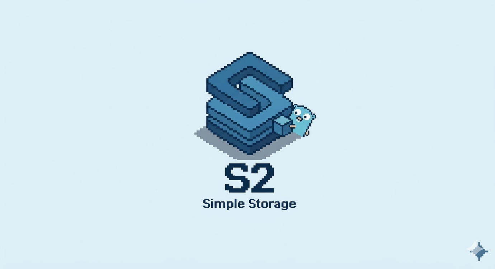
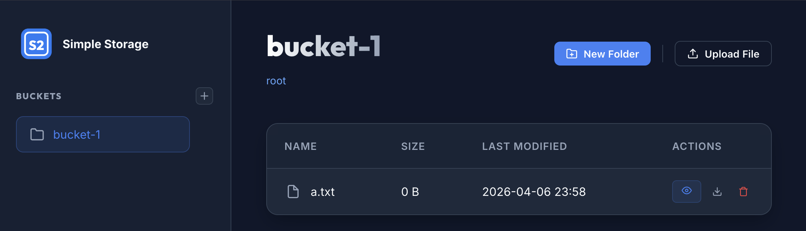

<p align="center">
  
</p>

# S2 — Simple Storage

[](https://pkg.go.dev/github.com/mojatter/s2)
[](https://goreportcard.com/report/github.com/mojatter/s2)

S2 is a lightweight object storage library and S3-compatible server written in Go.
It provides a unified interface for multiple storage backends and an embeddable S3-compatible server — all in a single package.

## Why S2?

MinIO was the go-to S3-compatible server for local development, but it entered maintenance mode in December 2025 and was archived in February 2026. S2 fills this gap with a different philosophy:

- **Library-first** — Use S2 as a Go library with a clean interface, or run it as a server. Most alternatives are server-only.
- **Truly lightweight** — Single binary, no external dependencies, starts in milliseconds.
- **Test-friendly** — Use `memfs` backend for fast, isolated tests without Docker or external processes.

## Migrating from MinIO

For most local-development use cases, replacing MinIO with S2 is a one-line change in `docker-compose.yml`. S2 listens on the same `:9000` port and serves the S3 API under `/s3api`.

**docker-compose.yml**

```yaml
services:
  s3:
    image: mojatter/s2-server
    ports:
      - "9000:9000"
    environment:
      S2_SERVER_USER: myuser
      S2_SERVER_PASSWORD: mypassword
      S2_SERVER_BUCKETS: assets,uploads
    volumes:
      - s2-data:/var/lib/s2

volumes:
  s2-data:
```

**Endpoint difference** — MinIO serves the S3 API at the root (`http://localhost:9000`), while S2 serves it under `/s3api` (`http://localhost:9000/s3api`). Update your S3 client's endpoint URL accordingly. The path under `/s3api` is reserved for the Web Console.

**Environment variable mapping**

| MinIO | S2 |
|-------|----|
| `MINIO_ROOT_USER` | `S2_SERVER_USER` |
| `MINIO_ROOT_PASSWORD` | `S2_SERVER_PASSWORD` |
| `MINIO_VOLUMES` | `S2_SERVER_ROOT` (default `/var/lib/s2`) |
| `MINIO_DEFAULT_BUCKETS` | `S2_SERVER_BUCKETS` |

**Migrating existing data** — S2's `osfs` backend stores objects as plain files on disk (no proprietary format), so any S3 client can copy data over:

```sh
# Mirror an existing MinIO instance into a fresh S2 instance
aws --endpoint-url http://old-minio:9000 s3 sync s3://my-bucket /tmp/dump
aws --endpoint-url http://localhost:9000/s3api s3 sync /tmp/dump s3://my-bucket
```

Or use `mc mirror` directly between the two endpoints.

## Features

- **Unified Storage Interface** — One API for local filesystem, in-memory, and AWS S3 backends
- **S3-Compatible Server** — Serve any backend over S3 APIs; a drop-in replacement for MinIO in local development
- **Lightweight** — Minimal dependencies, single binary, `go install` ready
- **Pluggable Backends** — Register storage implementations with a blank import
- **Web Console** — Built-in browser interface for managing buckets and objects

<p align="center">
  
</p>

## Install

```sh
go get github.com/mojatter/s2
```

To install the S2 server CLI:

```sh
go install github.com/mojatter/s2/cmd/s2-server@latest
```

Or run with Docker:

```sh
docker run -p 9000:9000 mojatter/s2-server
```

## Quick Start

### As a Library

Define your storage backends in a JSON config file:

```json
{
  "assets": {
    "type": "osfs",
    "root": "/var/data/assets"
  },
  "backups": {
    "type": "s3",
    "root": "my-backup-bucket"
  }
}
```

Load and use them with `s2env`:

```go
package main

import (
	"context"
	"fmt"

	"github.com/mojatter/s2"
	"github.com/mojatter/s2/s2env"
)

func main() {
	ctx := context.Background()

	// Load all storages from config file
	storages, err := s2env.Load(ctx, "s2.json")
	if err != nil {
		panic(err)
	}

	// Use a named storage
	assets := storages["assets"]

	// Put an object
	obj := s2.NewObjectBytes("hello.txt", []byte("Hello, S2!"))
	if err := assets.Put(ctx, obj); err != nil {
		panic(err)
	}

	// List objects
	objects, _, err := assets.List(ctx, "", 100)
	if err != nil {
		panic(err)
	}
	for _, o := range objects {
		fmt.Println(o.Name())
	}
}
```

`s2env` automatically registers all built-in backends (`osfs`, `memfs`, `s3`), so no blank imports are needed.

### As a Local S3 Server

Start the server:

```sh
# via go install
s2-server

# via Docker
docker run -p 9000:9000 -v /your/data:/var/lib/s2 mojatter/s2-server
```

Then access it with any S3 client:

```go
package main

import (
	"context"
	"fmt"

	"github.com/mojatter/s2"
	_ "github.com/mojatter/s2/s3" // Register S3 backend
)

func main() {
	ctx := context.Background()
	strg, err := s2.NewStorage(ctx, s2.Config{
		Type: s2.TypeS3,
		Root: "my-bucket",
		S3: &s2.S3Config{
			EndpointURL: "http://localhost:9000/s3api",
		},
	})
	if err != nil {
		panic(err)
	}
	objects, _, err := strg.List(ctx, "", 1000)
	if err != nil {
		panic(err)
	}
	fmt.Printf("%v\n", objects)
}
```

Or use the AWS CLI:

```sh
aws --endpoint-url http://localhost:9000/s3api s3 ls
aws --endpoint-url http://localhost:9000/s3api s3 cp ./file.txt s3://my-bucket/file.txt
```

### In Tests

For tests, swap any backend for `memfs` to get an isolated, in-process storage with no Docker, no temp directories, and no cleanup. The same `s2.Storage` interface is used in production and tests.

```go
package mypkg_test

import (
	"context"
	"testing"

	"github.com/mojatter/s2"
	_ "github.com/mojatter/s2/fs" // registers memfs
)

func TestUploadAvatar(t *testing.T) {
	ctx := context.Background()
	strg, err := s2.NewStorage(ctx, s2.Config{Type: s2.TypeMemFS})
	if err != nil {
		t.Fatal(err)
	}

	if err := UploadAvatar(ctx, strg, "user-1", []byte("...")); err != nil {
		t.Fatal(err)
	}
	// assert via strg.Get / strg.List ...
}
```

The `s2test` package provides reusable assertion helpers (e.g. `s2test.TestStorageList`) for validating `Storage` implementations and exercising your own code against any backend.

## Storage Backends

| Type | Import | Description |
|------|--------|-------------|
| `osfs` | `github.com/mojatter/s2/fs` | Local filesystem storage |
| `memfs` | `github.com/mojatter/s2/fs` | In-memory filesystem (great for testing) |
| `s3` | `github.com/mojatter/s2/s3` | AWS S3 (and any S3-compatible service) |

Backends are registered via blank imports. Import only what you need:

```go
import (
	_ "github.com/mojatter/s2/fs" // osfs + memfs
	_ "github.com/mojatter/s2/s3" // AWS S3
)
```

## S3 Backend Configuration

When using the `s3` backend, you can provide S3-specific settings via `S3Config`. Any field left empty falls back to the AWS SDK defaults (environment variables, `~/.aws/config`, IAM roles, etc.).

```go
strg, err := s2.NewStorage(ctx, s2.Config{
    Type: s2.TypeS3,
    Root: "my-bucket/optional-prefix",
    S3: &s2.S3Config{
        EndpointURL:    "http://localhost:9000/s3api",
        Region:         "ap-northeast-1",
        AccessKeyID:    "s2user",
        SecretAccessKey: "s2password",
    },
})
```

With `s2env`, use the `"s3"` key in JSON:

```json
{
  "local": {
    "type": "s3",
    "root": "dev-bucket",
    "s3": {
      "endpoint_url": "http://localhost:9000/s3api",
      "access_key_id": "myuser",
      "secret_access_key": "mypassword"
    }
  },
  "prod": {
    "type": "s3",
    "root": "prod-bucket",
    "s3": {
      "region": "ap-northeast-1"
    }
  }
}
```

| Field | Description |
|-------|-------------|
| `endpoint_url` | Custom S3-compatible endpoint URL |
| `region` | AWS region (e.g. `ap-northeast-1`) |
| `access_key_id` | AWS access key ID |
| `secret_access_key` | AWS secret access key |

When `S3Config` is nil or all fields are empty, the standard AWS SDK credential chain is used.

## Storage Interface

```go
type Storage interface {
	Type() Type
	Sub(ctx context.Context, prefix string) (Storage, error)
	List(ctx context.Context, prefix string, limit int) ([]Object, []string, error)
	ListAfter(ctx context.Context, prefix string, limit int, after string) ([]Object, []string, error)
	ListRecursive(ctx context.Context, prefix string, limit int) ([]Object, error)
	ListRecursiveAfter(ctx context.Context, prefix string, limit int, after string) ([]Object, error)
	Get(ctx context.Context, name string) (Object, error)
	Exists(ctx context.Context, name string) (bool, error)
	Put(ctx context.Context, obj Object) error
	PutMetadata(ctx context.Context, name string, metadata Metadata) error
	Copy(ctx context.Context, src, dst string) error
	Move(ctx context.Context, src, dst string) error
	Delete(ctx context.Context, name string) error
	DeleteRecursive(ctx context.Context, prefix string) error
	SignedURL(ctx context.Context, name string, ttl time.Duration) (string, error)
}
```

## Server Configuration

### Environment Variables

| Variable | Default | Description |
|----------|---------|-------------|
| `S2_SERVER_CONFIG` | — | Path to JSON config file |
| `S2_SERVER_LISTEN` | `:9000` | Listen address |
| `S2_SERVER_TYPE` | `osfs` | Storage backend type |
| `S2_SERVER_ROOT` | `/var/lib/s2` | Root directory for bucket data |
| `S2_SERVER_USER` | — | Username for authentication (disables auth if empty) |
| `S2_SERVER_PASSWORD` | — | Password for authentication |
| `S2_SERVER_BUCKETS` | — | Comma-separated list of buckets to create on startup |

Environment variables take precedence over the config file.
Other settings (such as S3 backend options) are not configurable via environment variables — use `S2_SERVER_CONFIG` to point to a JSON config file instead.

### Authentication

When `S2_SERVER_USER` is set, the server requires credentials on all routes:

- **Web Console** — HTTP Basic Auth
- **S3 API** — AWS Signature Version 4 (`S2_SERVER_USER` as the Access Key ID, `S2_SERVER_PASSWORD` as the Secret Access Key)

```sh
S2_SERVER_USER=myuser S2_SERVER_PASSWORD=mypassword s2-server
```

Using the AWS CLI:

```sh
AWS_ACCESS_KEY_ID=myuser AWS_SECRET_ACCESS_KEY=mypassword \
  aws --endpoint-url http://localhost:9000/s3api s3 ls
```

Or via a named profile in `~/.aws/config`:

```ini
[profile s2]
endpoint_url = http://localhost:9000/s3api
aws_access_key_id = myuser
aws_secret_access_key = mypassword
```

```sh
aws --profile s2 s3 ls
```

When `S2_SERVER_USER` is empty (the default), authentication is disabled.

**Presigned URLs** — S2 verifies AWS SigV4 signatures passed in the query string (`X-Amz-Algorithm=AWS4-HMAC-SHA256`, `X-Amz-Signature`, …), so URLs produced by `s3.NewPresignClient` (Go) or `s3.getSignedUrl` (JavaScript) work for GET and PUT. The body of a presigned PUT is treated as `UNSIGNED-PAYLOAD`.

### Config File

```json
{
  "listen": ":9000",
  "type": "osfs",
  "root": "/var/lib/s2",
  "user": "myuser",
  "password": "mypassword",
  "buckets": ["assets", "uploads"]
}
```

```sh
s2-server -f config.json
```

### S3 API Endpoints

| Method | Path | Operation |
|--------|------|-----------|
| GET | `/s3api` | ListBuckets |
| PUT | `/s3api/{bucket}` | CreateBucket |
| HEAD | `/s3api/{bucket}` | HeadBucket |
| DELETE | `/s3api/{bucket}` | DeleteBucket |
| GET | `/s3api/{bucket}?location` | GetBucketLocation |
| GET | `/s3api/{bucket}` | ListObjectsV2 |
| GET | `/s3api/{bucket}/{key...}` | GetObject (Range supported) |
| HEAD | `/s3api/{bucket}/{key...}` | HeadObject |
| PUT | `/s3api/{bucket}/{key...}` | PutObject / CopyObject |
| DELETE | `/s3api/{bucket}/{key...}` | DeleteObject |
| POST | `/s3api/{bucket}?delete` | DeleteObjects |
| POST | `/s3api/{bucket}/{key...}?uploads` | CreateMultipartUpload |
| PUT | `/s3api/{bucket}/{key...}?uploadId&partNumber` | UploadPart |
| POST | `/s3api/{bucket}/{key...}?uploadId` | CompleteMultipartUpload |
| DELETE | `/s3api/{bucket}/{key...}?uploadId` | AbortMultipartUpload |

Custom metadata is supported via `x-amz-meta-*` headers on PutObject/CopyObject and returned on GetObject/HeadObject.

## Limitations

S2 aims to cover the parts of the S3 API that matter for local development and lightweight production use. Some features are intentionally **not** implemented:

- **Object versioning** — `VersionId`, version listing, and `s3:GetObjectVersion` are not supported. Buckets behave as if versioning is permanently disabled.
- **ListObjectsV2 only** — The legacy `ListObjects` (V1) API is not implemented. Most modern SDKs use V2 by default; older clients may need configuration changes.
- **Server-side encryption (SSE-S3 / SSE-KMS / SSE-C)** — Not implemented. Use full-disk encryption at the OS level if needed.
- **Bucket policies, ACLs, IAM** — Authentication is a single user/password pair; there is no per-bucket or per-object access control. For multi-tenant scenarios, use AWS S3 or another full-featured implementation.
- **Replication, lifecycle rules, object lock** — Not implemented.

If your use case needs any of the above, S2 is probably not the right tool — consider AWS S3, Ceph RGW, or SeaweedFS.

## License

MIT

## Credits

The header image was generated with [Google Gemini](https://gemini.google.com/).
It includes the Go Gopher mascot, originally designed by [Renée French](https://reneefrench.blogspot.com/) and licensed under [CC BY 3.0](https://creativecommons.org/licenses/by/3.0/).
